# 巫巫女睡前故事集（wuwunv）


这是一个围绕「巫巫女」展开的睡前与静心故事合集，适合大人和小朋友一起听。  
故事发生在一片住着巫巫女的森林里，那里有会记忆心事的小木屋、会托梦的花田和偶尔会说话的风。巫巫女会用奇妙的小道具、温柔的魔法和一点点笨拙的勇气，陪你一起看见、理解和安放那些不太好开口的情绪。  
这些故事适合在睡前、通勤路上，或任何需要一点安静陪伴的时候慢慢听完。

## 故事目录

| 编号 | 封面 | 文稿 | 音频 |
| ---- | ---- | ---- | ---- |
| 01 | 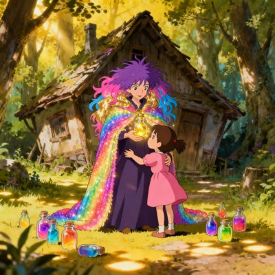 | [巫巫女的心变了](01-巫巫女的心变了.md) | [audio/01-巫巫女的心变了.mp3](audio/01-巫巫女的心变了.mp3) |
| 02 | 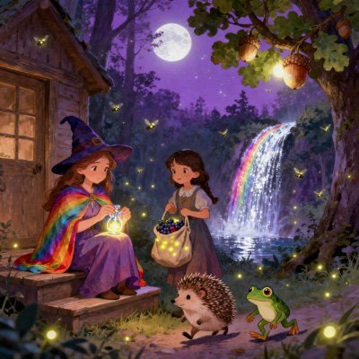 | [巫巫女的月光坚果](02-巫巫女的月光坚果.md) | [audio/02-巫巫女的月光坚果.mp3](audio/02-巫巫女的月光坚果.mp3) |
| 03 | 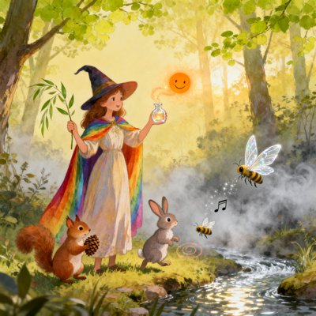 | [巫巫女的声音宝藏](03-巫巫女的声音宝藏.md) | [audio/03-巫巫女的声音宝藏.mp3](audio/03-巫巫女的声音宝藏.mp3) |
| 04 | 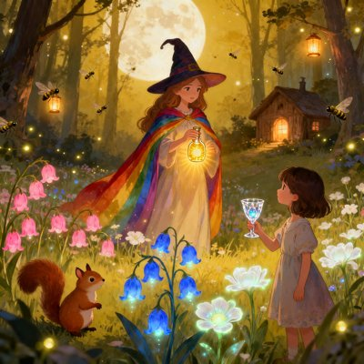 | [巫巫女的梦境花田](04-巫巫女的梦境花田.md) | [audio/04-巫巫女的梦境花田.mp3](audio/04-巫巫女的梦境花田.mp3) |
| 05 | 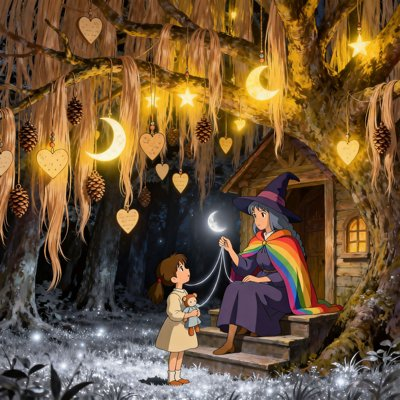 | [巫巫女的月光心愿挂饰](05-巫巫女的月光心愿挂饰.md) | [audio/05-巫巫女的月光心愿挂饰.mp3](audio/05-巫巫女的月光心愿挂饰.mp3) |
| 06 | 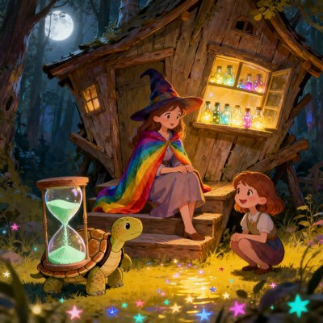 | [巫巫女的耐心沙漏](06-巫巫女的耐心沙漏.md) | [audio/06-巫巫女的耐心沙漏.mp3](audio/06-巫巫女的耐心沙漏.mp3) |
| 07 |  | [巫巫女的思念共鸣瓶](07-巫巫女的思念共鸣瓶.md) | [audio/07-巫巫女的思念共鸣瓶.mp3](audio/07-巫巫女的思念共鸣瓶.mp3) |
| 08 | 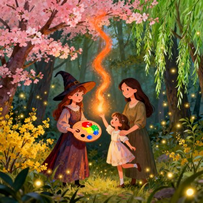 | [巫巫女的季节调色盘](08-巫巫女的季节调色盘.md) | [audio/08-巫巫女的季节调色盘.mp3](audio/08-巫巫女的季节调色盘.mp3) |
| 09 | 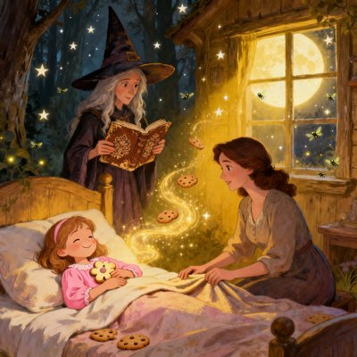 | [巫巫女的梦境食谱](09-巫巫女的梦境食谱.md) | [audio/09-巫巫女的梦境食谱.mp3](audio/09-巫巫女的梦境食谱.mp3) |
| 10 | 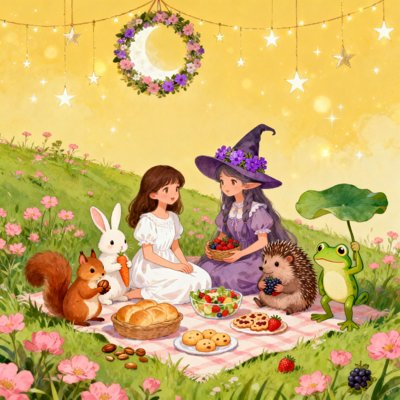 | [巫巫女的春日野餐](10-巫巫女的春日野餐.md) | [audio/10-巫巫女的春日野餐.mp3](audio/10-巫巫女的春日野餐.mp3) |
| 11 | 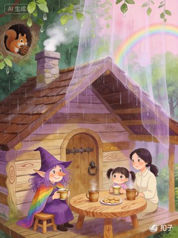 | [雨中的小木屋茶会](11-雨中的小木屋茶会.md) | [audio/11-雨中的小木屋茶会.mp3](audio/11-雨中的小木屋茶会.mp3) |
| 12 | 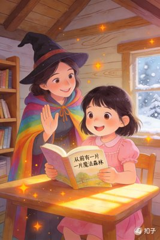 | [莉莉的新本领](12-莉莉的新本领.md) | [audio/12-莉莉的新本领.mp3](audio/12-莉莉的新本领.mp3) |
| 13 | 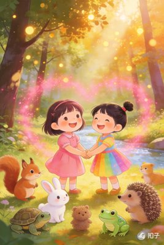 | [莉莉和小时候的巫巫女](13-莉莉和小时候的巫巫女.md) | [audio/13-莉莉和小时候的巫巫女.mp3](audio/13-莉莉和小时候的巫巫女.mp3) |
| 14 | 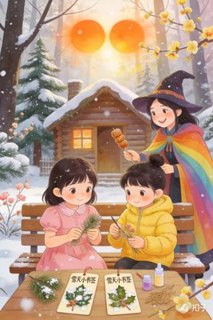 | [寒假里的好朋友欣欣](14-寒假里的好朋友欣欣.md) | [audio/14-寒假里的好朋友欣欣.mp3](audio/14-寒假里的好朋友欣欣.mp3) |
| 15 |  | [游轮上的初次相遇](15-游轮上的初次相遇.md) | [audio/15-游轮上的初次相遇.mp3](audio/15-游轮上的初次相遇.mp3) |
| 16 |  | [巫巫女的海洋星星收集之旅](16-巫巫女的海洋星星收集之旅.md) | [audio/16-巫巫女的海洋星星收集之旅.mp3](audio/16-巫巫女的海洋星星收集之旅.mp3) |
| 17 |  | [游轮上的月光心愿瓶](17-游轮上的月光心愿瓶.md) | [audio/17-游轮上的月光心愿瓶.mp3](audio/17-游轮上的月光心愿瓶.mp3) |
| 18 |  | [海上日出的金色光芒](18-海上日出的金色光芒.md) | [audio/18-海上日出的金色光芒.mp3](audio/18-海上日出的金色光芒.mp3) |
| 19 |  | [船舱里的秘密乐队](19-船舱里的秘密乐队.md) | [audio/19-船舱里的秘密乐队.mp3](audio/19-船舱里的秘密乐队.mp3) |
| 20 | 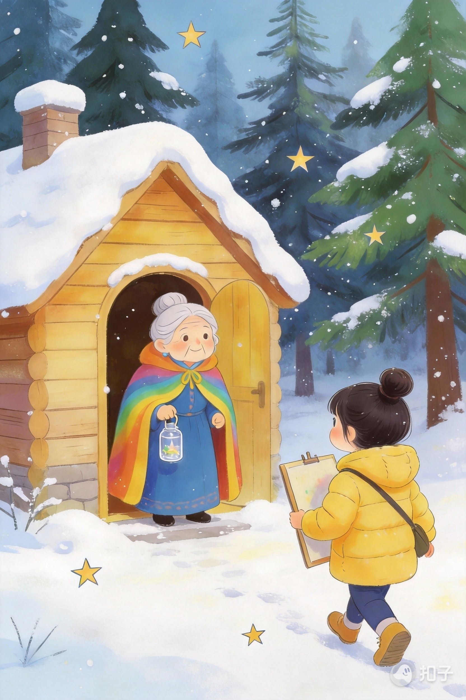 | [欣欣的冬日小秘密](20-欣欣的冬日小秘密.md) | [audio/20-欣欣的冬日小秘密.mp3](audio/20-欣欣的冬日小秘密.mp3) |
| 21 | 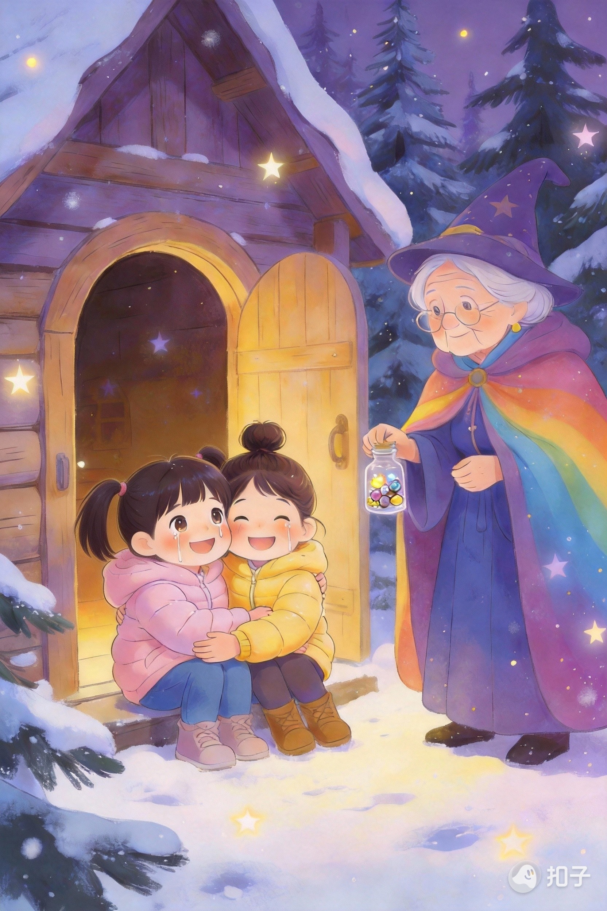 | [莉莉和欣欣的小秘密](21-莉莉和欣欣的小秘密.md) | [audio/21-莉莉和欣欣的小秘密.mp3](audio/21-莉莉和欣欣的小秘密.mp3) |

## 关于创作方式

本项目中的故事文本由作者 Jiang Le 构思与统筹，创作过程中使用了多个大模型工具（如 DeepSeek、豆包、扣子等）进行辅助生成与润色，最终内容由作者统一整理与修改后发布。

封面图片由作者设定草图与风格方向，并使用 AI 绘图工具生成，最终效果由作者选择与调整。

## 语音合成说明

本项目中的部分或全部故事音频并非真人录音，而是使用豆包 App 的「温柔桃子」音色进行文本转语音（TTS）合成。

- 故事文本及整体作品版权归作者 Jiang Le 所有。
- 语音合成技术与音色由豆包 App 提供，具体使用限制以豆包官方服务条款为准。
- 本项目中使用该音频仅限个人非商业创作与分享，不构成任何形式的专业建议或商业服务。

## 目录结构概览

- `*.md`：单篇故事文本与相关文档（如《莉莉的新本领》等）
- `设定文档.md`：世界观、角色、背景设定等
- `audio/`：故事音频文件与封面图片
- `scripts/`：
  - `process_audio.py`：从录屏中提取音频、自动裁剪静音、添加淡入效果与元数据的工具
  - `add_metadata_to_existing.py`：为已有音频文件补充封面与元数据
  - 其他批处理脚本

## 脚本使用说明（简要）

以下仅为极简示例，具体参数与使用习惯可根据个人需要调整。

- 从录屏视频中生成故事音频：

```bash
python scripts/process_audio.py path/to/录屏文件.mov
```

脚本会自动：

- 提取音频为 MP3
- 检测并裁剪开头和结尾的静音
- 为音频添加轻微淡入效果
- 根据文件名自动查找对应的故事 `.md` 和封面图片
- 将故事标题、简介和全文写入 MP3 元数据

## 授权信息

本仓库包含两类内容，适用不同授权条款：

1. **文本与多媒体内容**
   - 包括但不限于：所有故事 `.md` 文件、`设定文档` 等设定文档、图片、音频、视频等。
   - **版权归作者 Jiang Le 所有。**
   - 采用 **Creative Commons BY-NC-SA 4.0**（署名-非商业性使用-相同方式共享）协议授权。
   - 协议全文参见：https://creativecommons.org/licenses/by-nc-sa/4.0/

2. **代码文件**
   - 包括但不限于：`scripts/` 目录下的所有 `.py` 等源代码文件。
   - **版权归作者 Jiang Le 所有。**
   - 采用 **GNU General Public License v3.0（GPL-3.0）** 授权。
   - 具体条款见 `scripts/LICENSE`。

除非另有特别说明，本仓库内容均遵循上述相应条款。

## 致谢

感谢所有愿意阅读、收听、分享这些故事的人。  
如果这些内容对你有帮助，欢迎在 GitHub 上点一个 Star，或在你的非商业项目中注明来源后引用。***
