# 巫巫女睡前故事集（wuwunv）


这是一个围绕「巫巫女」展开的睡前与静心故事合集，适合大人和小朋友一起听。  
故事发生在一片住着巫巫女的森林里，那里有会记忆心事的小木屋、会托梦的花田和偶尔会说话的风。巫巫女会用奇妙的小道具、温柔的魔法和一点点笨拙的勇气，陪你一起看见、理解和安放那些不太好开口的情绪。  
这些故事适合在睡前、通勤路上，或任何需要一点安静陪伴的时候慢慢听完。

## 故事目录

| 编号 | 封面 | 文稿 | 音频 |
| ---- | ---- | ---- | ---- |
| 01 | 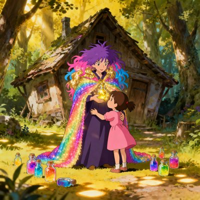 | [巫巫女的心变了](01-巫巫女的心变了.md) | [audio/01-巫巫女的心变了.mp3](audio/01-巫巫女的心变了.mp3) |
| 02 | 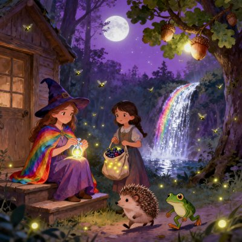 | [巫巫女的月光坚果](02-巫巫女的月光坚果.md) | [audio/02-巫巫女的月光坚果.mp3](audio/02-巫巫女的月光坚果.mp3) |
| 03 | 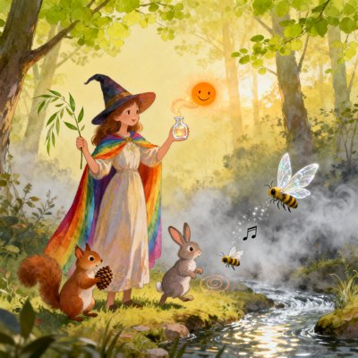 | [巫巫女的声音宝藏](03-巫巫女的声音宝藏.md) | [audio/03-巫巫女的声音宝藏.mp3](audio/03-巫巫女的声音宝藏.mp3) |
| 04 | 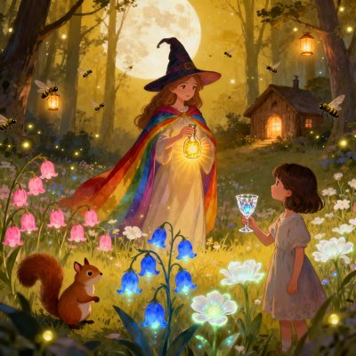 | [巫巫女的梦境花田](04-巫巫女的梦境花田.md) | [audio/04-巫巫女的梦境花田.mp3](audio/04-巫巫女的梦境花田.mp3) |
| 05 |  | [巫巫女的月光心愿挂饰](05-巫巫女的月光心愿挂饰.md) | [audio/05-巫巫女的月光心愿挂饰.mp3](audio/05-巫巫女的月光心愿挂饰.mp3) |
| 06 | 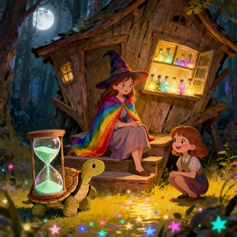 | [巫巫女的耐心沙漏](06-巫巫女的耐心沙漏.md) | [audio/06-巫巫女的耐心沙漏.mp3](audio/06-巫巫女的耐心沙漏.mp3) |
| 07 |  | [巫巫女的思念共鸣瓶](07-巫巫女的思念共鸣瓶.md) | [audio/07-巫巫女的思念共鸣瓶.mp3](audio/07-巫巫女的思念共鸣瓶.mp3) |
| 08 | 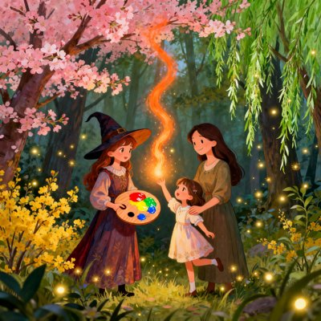 | [巫巫女的季节调色盘](08-巫巫女的季节调色盘.md) | [audio/08-巫巫女的季节调色盘.mp3](audio/08-巫巫女的季节调色盘.mp3) |
| 09 | 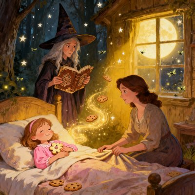 | [巫巫女的梦境食谱](09-巫巫女的梦境食谱.md) | [audio/09-巫巫女的梦境食谱.mp3](audio/09-巫巫女的梦境食谱.mp3) |
| 10 |  | [巫巫女的春日野餐](10-巫巫女的春日野餐.md) | [audio/10-巫巫女的春日野餐.mp3](audio/10-巫巫女的春日野餐.mp3) |
| 11 | 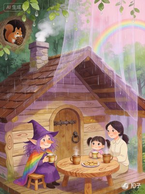 | [雨中的小木屋茶会](11-雨中的小木屋茶会.md) | [audio/11-雨中的小木屋茶会.mp3](audio/11-雨中的小木屋茶会.mp3) |
| 12 | 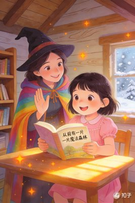 | [莉莉的新本领](12-莉莉的新本领.md) | [audio/12-莉莉的新本领.mp3](audio/12-莉莉的新本领.mp3) |
| 13 | 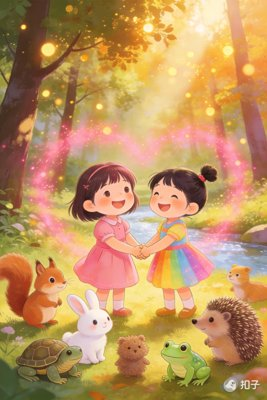 | [莉莉和小时候的巫巫女](13-莉莉和小时候的巫巫女.md) | [audio/13-莉莉和小时候的巫巫女.mp3](audio/13-莉莉和小时候的巫巫女.mp3) |
| 14 | 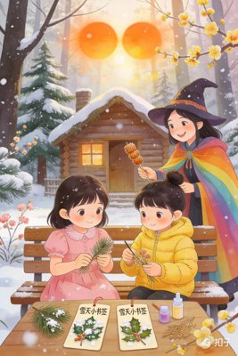 | [莉莉的新朋友欣欣](14-莉莉的新朋友欣欣.md) | [audio/14-莉莉的新朋友欣欣.mp3](audio/14-莉莉的新朋友欣欣.mp3) |
| 15 |  | [游轮上的初次相遇](15-游轮上的初次相遇.md) | [audio/15-游轮上的初次相遇.mp3](audio/15-游轮上的初次相遇.mp3) |
| 16 |  | [巫巫女的海洋星星收集之旅](16-巫巫女的海洋星星收集之旅.md) | [audio/16-巫巫女的海洋星星收集之旅.mp3](audio/16-巫巫女的海洋星星收集之旅.mp3) |
| 17 | 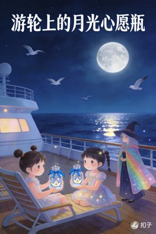 | [游轮上的月光心愿瓶](17-游轮上的月光心愿瓶.md) | [audio/17-游轮上的月光心愿瓶.mp3](audio/17-游轮上的月光心愿瓶.mp3) |
| 18 | 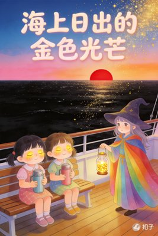 | [海上日出的金色光芒](18-海上日出的金色光芒.md) | [audio/18-海上日出的金色光芒.mp3](audio/18-海上日出的金色光芒.mp3) |
| 19 | 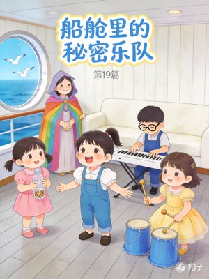 | [船舱里的秘密乐队](19-船舱里的秘密乐队.md) | [audio/19-船舱里的秘密乐队.mp3](audio/19-船舱里的秘密乐队.mp3) |
| 20 | 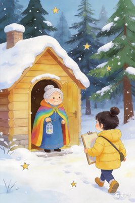 | [欣欣的冬日小秘密](20-欣欣的冬日小秘密.md) | [audio/20-欣欣的冬日小秘密.mp3](audio/20-欣欣的冬日小秘密.mp3) |
| 21 | 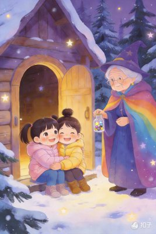 | [莉莉和欣欣的小秘密](21-莉莉和欣欣的小秘密.md) | [audio/21-莉莉和欣欣的小秘密.mp3](audio/21-莉莉和欣欣的小秘密.mp3) |
| 22 | 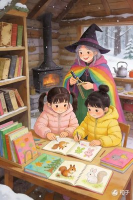 | [莉莉和欣欣的森林绘本计划](22-莉莉和欣欣的森林绘本计划.md) | [audio/22-莉莉和欣欣的森林绘本计划.mp3](audio/22-莉莉和欣欣的森林绘本计划.mp3) |
| 23 |  | [森林小动物的音乐狂欢日](23-森林小动物的音乐狂欢日.md) | [audio/23-森林小动物的音乐狂欢日.mp3](audio/23-森林小动物的音乐狂欢日.mp3) |
| 24 |  | [莉莉和欣欣的魔法树屋大冒险](24-莉莉和欣欣的魔法树屋大冒险.md) | [audio/24-莉莉和欣欣的魔法树屋大冒险.mp3](audio/24-莉莉和欣欣的魔法树屋大冒险.mp3) |
| 25 |  | [寒假班的小勇气](25-寒假班的小勇气.md) | [audio/25-寒假班的小勇气.mp3](audio/25-寒假班的小勇气.mp3) |
| 26 |  | [魔法肥料花园的小意外](26-魔法肥料花园的小意外.md) | [audio/26-魔法肥料花园的小意外.mp3](audio/26-魔法肥料花园的小意外.mp3) |

## 关于创作方式

本项目中的故事文本由作者 Jiang Le 构思与统筹，创作过程中使用了多个大模型工具（如 DeepSeek、豆包、扣子等）进行辅助生成与润色，最终内容由作者统一整理与修改后发布。

封面图片由作者设定草图与风格方向，并使用 AI 绘图工具生成，最终效果由作者选择与调整。

## 语音合成说明

本项目中的部分或全部故事音频并非真人录音，而是使用 **MiniMax TTS API** 的复刻音色进行文本转语音（TTS）合成。

- 故事文本及整体作品版权归作者 Jiang Le 所有。
- 语音合成使用 MiniMax Speech 2.8 HD 模型，基于复刻的「温柔桃子」音色。
- 本项目中使用该音频仅限个人非商业创作与分享，不构成任何形式的专业建议或商业服务。

**技术配置**：
- TTS 模型：MiniMax speech-2.8-hd
- 音色 ID：wuwunv_gentle_taozi（复刻音色）
- 情感模式：gentle（温柔）
- 速率限制：10 次/分钟（符合 API 限制）

## 目录结构概览

```
wuwunv/
├── *.md                    # 故事文本文件
├── 设定文档.md              # 世界观、角色、背景设定
├── README.md               # 项目说明文档
├── requirements.txt        # Python 依赖
├── .env                    # API 密钥配置
├── audio/                  # 音频和封面目录
│   ├── *.mp3              # 故事音频文件
│   ├── *.jpeg/.jpg        # 封面图片
│   ├── thumbnails/        # 缩略图
│   └── references/        # 角色参考图
└── scripts/               # 音频处理和自动化工具
    ├── generate_story.py          # 一键生成音频+封面
    ├── generate_audio.py          # 音频生成
    ├── generate_cover.py          # 封面生成
    ├── minimax_api.py             # MiniMax TTS API
    ├── volcengine_api.py          # 火山引擎即梦 AI API
    ├── config.py                  # 项目配置
    ├── clone_voice.py             # 音色克隆工具
    ├── process_audio.py           # 从录屏提取音频（备用）
    ├── add_metadata_to_existing.py # 添加元数据
    ├── batch_add_metadata.py      # 批量添加元数据
    ├── generate_thumbnails.py     # 生成缩略图
    └── verify_audio.py            # 验证音频元数据
```

## 音频处理工具使用说明

### 环境配置

**安装依赖**：
```bash
pip install -r requirements.txt
```

**配置 API 密钥**（在 `.env` 文件中）：
```env
# MiniMax TTS 配置
MINIMAX_API_KEY=your_minimax_api_key
MINIMAX_VOICE_ID=wuwunv_gentle_taozi

# 火山引擎即梦 AI 配置
VOLCENGINE_ACCESS_KEY=your_access_key
VOLCENGINE_SECRET_KEY=your_secret_key
```

**准备角色参考图**：
在 `audio/references/` 目录中放置角色参考图：
- `巫巫女_reference.jpg`
- `莉莉_reference.jpg`
- `欣欣_reference.jpg`

### 主要脚本

#### generate_story.py - 一键生成（推荐）

整合脚本，自动生成音频和封面。

```bash
# 生成完整故事（音频 + 封面）
python scripts/generate_story.py "01-巫巫女的心变了.md"

# 只生成音频
python scripts/generate_story.py "01-巫巫女的心变了.md" --skip-cover

# 只生成封面（音频必须已存在）
python scripts/generate_story.py "01-巫巫女的心变了.md" --skip-audio

# 强制重新生成
python scripts/generate_story.py "01-巫巫女的心变了.md" --force
```

#### generate_audio.py - 独立音频生成

使用 MiniMax TTS API 生成故事音频。

```bash
# 生成音频
python scripts/generate_audio.py "01-巫巫女的心变了.md"

# 强制重新生成
python scripts/generate_audio.py "01-巫巫女的心变了.md" --force
```

**特性**：
- 支持 MiniMax Speech 2.8 HD 模型
- 支持复刻音色
- 自动检测语气词标签
- 内置速率限制（10 次/分钟）

#### generate_cover.py - 独立封面生成

使用火山引擎即梦 AI 生成故事封面。

```bash
# 生成封面
python scripts/generate_cover.py "01-巫巫女的心变了.md"

# 强制重新生成
python scripts/generate_cover.py "01-巫巫女的心变了.md" --force
```

**特性**：
- 支持多角色参考图（最多10张）
- 支持自定义图片尺寸和质量
- 异步任务提交 + 轮询

#### clone_voice.py - 音色克隆

MiniMax 音色克隆工具，用于创建自定义音色。

```bash
# 快速复刻音色
python scripts/clone_voice.py clone --audio audio/sample.mp3 --voice-id my_voice

# 查询可用音色
python scripts/clone_voice.py list
```

### 故事文件格式

故事文件支持 YAML frontmatter 来自定义封面生成：

```markdown
---
title: 故事标题
cover_prompt: "自定义的封面提示词，描述画面场景和风格"
cover_characters:
  - 巫巫女
  - 莉莉
---

# 故事正文

这里写故事内容...
```

### 元数据管理

#### add_metadata_to_existing.py

为已有音频添加元数据（标题、内容、封面）。

```bash
python scripts/add_metadata_to_existing.py audio/01-巫巫女的心变了.mp3
```

#### batch_add_metadata.py

批量处理 `audio/` 目录中所有缺少元数据的 MP3 文件。

```bash
# 批量处理
python scripts/batch_add_metadata.py

# 模拟运行（查看会处理哪些文件）
python scripts/batch_add_metadata.py --dry-run
```

#### verify_audio.py

验证音频文件的元数据和封面。

```bash
python scripts/verify_audio.py audio/01-巫巫女的心变了.mp3
```

验证脚本会显示：
- ✓ 基本信息（时长、比特率等）
- ✓ 元数据（标题、艺术家、专辑、类型）
- ✓ 封面信息（MIME 类型、大小，并会提取封面保存为文件）
- ✓ 简介和全文信息

### 传统工具（备用）

#### process_audio.py

从录屏视频中提取音频、去除静音、添加淡入效果。

```bash
# 基本用法（自动查找封面和故事）
python scripts/process_audio.py screen_recording.mov

# 指定输出文件
python scripts/process_audio.py screen_recording.mov output.mp3

# 指定封面和故事
python scripts/process_audio.py screen_recording.mov output.mp3 cover.jpg story.md
```

脚本会自动：
- 提取音频为 MP3
- 检测并裁剪开头和结尾的静音
- 为音频添加轻微淡入效果
- 根据文件名自动查找对应的故事 `.md` 和封面图片
- 将故事标题、简介和全文写入 MP3 元数据

#### generate_thumbnails.py - 生成缩略图

为封面图片批量生成缩略图，用于 README 中的故事目录表格显示。

```bash
python scripts/generate_thumbnails.py
```

**特性**：
- 扫描 `audio/` 目录中的所有封面图片
- 在 `audio/thumbnails/` 下生成最长边不超过 400 像素的缩略图
- 缩略图命名：`{原文件名}_thumb.{扩展名}`

**重要提示**：
- 每次添加新故事并生成封面后，**务必运行此脚本更新缩略图**
- 否则 README 中的故事目录会显示损坏的图片链接

### 元数据说明

处理后的 MP3 文件会包含以下元数据：

- **标题**: 故事标题（从 .md 文件第一行读取）
- **艺术家**: "巫巫女睡前故事"
- **专辑**: "巫巫女睡前故事集"
- **类型**: "儿童故事"
- **封面**: 嵌入的图片
- **简介**: 故事的前几段（作为注释）
- **全文**: 完整的故事内容（作为歌词/文本字段）

### 文件命名规则

工具会自动匹配文件：

1. **封面图片**: 查找与音频文件同名的图片（去除括号内容）
   - 查找顺序：`audio/` 目录 → 当前目录 → 项目根目录
   - 支持的格式：`.jpg`, `.jpeg`, `.png`, `.gif`, `.bmp`

2. **故事文件**: 查找与音频文件同名的 Markdown 文件
   - 查找顺序：项目根目录 → 当前目录

### 完整工作流程

当创作一个新故事时，完整的工作流程如下：

```bash
# 1. 编写故事文件（如 26-新故事.md）
# 确保文件包含 frontmatter：title, cover_prompt, cover_characters

# 2. 生成音频和封面
python scripts/generate_story.py "26-新故事.md"

# 3. 添加元数据到音频
python scripts/add_metadata_to_existing.py "audio/26-新故事.mp3"

# 4. 生成缩略图（重要！否则 README 中的图片会显示不出来）
python scripts/generate_thumbnails.py

# 5. 验证结果
python scripts/verify_audio.py "audio/26-新故事.mp3"

# 6. 更新 README.md 中的故事目录表格，添加新故事行
```

### 注意事项

1. 确保 `ffmpeg` 已正确安装（仅传统功能需要）：`brew install ffmpeg`
2. 所有脚本需要在项目根目录下运行
3. 确保已配置 `.env` 文件中的 API 密钥
4. 角色参考图需要提前准备并放在 `audio/references/` 目录
5. MiniMax TTS API 速率限制为 10 次/分钟，脚本已自动处理
6. 火山引擎封面生成需要 5-10 分钟，请耐心等待
7. 静音检测阈值设置为 -30dB，持续 0.5 秒以上会被识别为静音

## 授权信息

本仓库包含两类内容，适用不同授权条款：

1. **文本与多媒体内容**
   - 包括但不限于：所有故事 `.md` 文件、`设定文档` 等设定文档、图片、音频、视频等。
   - **版权归作者 Jiang Le 所有。**
   - 采用 **Creative Commons BY-NC-SA 4.0**（署名-非商业性使用-相同方式共享）协议授权。
   - 协议全文参见：https://creativecommons.org/licenses/by-nc-sa/4.0/

2. **代码文件**
   - 包括但不限于：`scripts/` 目录下的所有 `.py` 等源代码文件。
   - **版权归作者 Jiang Le 所有。**
   - 采用 **GNU General Public License v3.0（GPL-3.0）** 授权。

除非另有特别说明，本仓库内容均遵循上述相应条款。

## 致谢

感谢所有愿意阅读、收听、分享这些故事的人。  
如果这些内容对你有帮助，欢迎在 GitHub 上点一个 Star，或在你的非商业项目中注明来源后引用。
